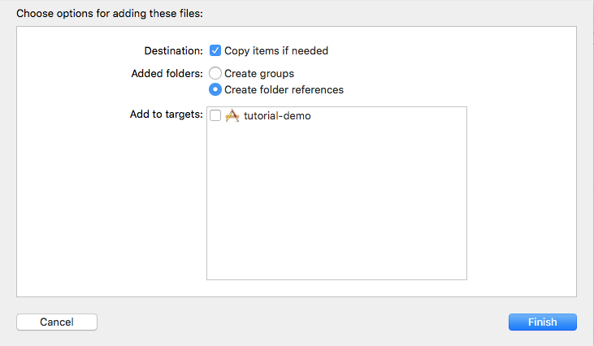

# Welcome to Shaka Player Embedded

## Prerequisites

Building Shaka Player Embedded requires the following:

* XCode
  * You will need XCode to build a project. We also use command-line tools, so
     you will need to run `xcode-select` at least once to enable those.
* Depot tools
  * Building Shaka Player Embedded requires Chromium's depot tools.
    See [Chromium's tutorial] on installing depot tools for details.
    Remember to add depot tools into your path!
* Python package `enum34`
  * This can be installed using [pip]. For more info, see the
    [project description].
* autoconf 2.57+
  * This can be installed using [homebrew]. Use the 'autoconf' formula.
* automake 1.7+
  * This can be installed using [homebrew]. Use the 'automake' formula.
* pkg-config
  * This can be installed using [homebrew]. Use the 'pkg-config' formula.
* cmake
  * This can be installed using [homebrew]. Use the 'cmake' formula.
* libtool
  * This can be installed using [homebrew]. Use the 'libtool' formula.

To summarize, you should install [homebrew] and [pip], if you don't already have
them, and then run:

```shell
sudo xcode-select --install -s /Applications/Xcode.app/Contents/Developer
brew install autoconf automake pkg-config cmake libtool
pip install --user enum34
```

## Building the framework

Once you have installed all of the prerequisites, it's time to build Shaka
Player Embedded.
If you don't already have it, you can fetch the code with:

```shell
git clone https://github.com/shaka-project/shaka-player-embedded.git
cd shaka-player-embedded
```

Then, you need to configure a build. Device builds and simulator builds require
different configuration values.
To configure for the iPhone simulator, you can do the following:

```shell
mkdir myBuildSim
cd myBuildSim
../configure --ios
```

To configure for deployment onto an actual iPhone, you just change the CPU you
are building for.

```shell
mkdir myBuild
cd myBuild
../configure --ios --cpu arm64
```

This will result in a debug configuration; if you want a release build, add the
`--release` argument.

Once you have made a configuration, you can run `make` to build the most recent
configuration. Or, if you want to build a specific configuration, you can run
the build script on that configuration.

```shell
../build.py
```

## Using the framework

Now that you have a complete framework, it's time to put it to use.

Make a new single-view project with XCode.

Inside the folder you put Shaka Player Embedded, navigate to the folder that you
made for your build, and find the files named `ShakaPlayerEmbedded.framework`
and `ShakaPlayerEmbedded.FFmpeg.framework`.  Drag that file into your project.
Be sure to check `copy items if needed`, and uncheck any `Add to targets` boxes.



Then, go to the project settings, and navigate to `General`. Go to `Embedded
Binaries`, and add `ShakaPlayerEmbedded.framework` and
`ShakaPlayerEmbedded.FFmpeg.framework` as an embedded binaries.


Next, navigate to `Build Settings`. Search for the `System Framework Search
Paths` setting. Be sure to have `All` checked, rather than `Basic` or
`Customized`. Add '\$(PROJECT_DIR)' to the setting. This is required to properly
link the framework.


Then, search for `Enable Bitcode`, and set it to `No`. At the moment, we do not
build the framework with Bitcode.


### If you are using Swift...

Go to `ViewController.swift`, and replace its contents with the following code:

```swift
import UIKit
import ShakaPlayerEmbedded

class ViewController: UIViewController, ShakaPlayerClient {
  func onPlayer(_ player: ShakaPlayer, error: ShakaPlayerError) {
    print("Got Shaka Player Error: \(error.message)")
  }

  override func viewWillAppear(_ animated: Bool) {
    super.viewWillAppear(animated)

    // Make a Shaka Player with its corresponding view.
    guard let player = try? ShakaPlayer() else {
      print("Error creating player")
      return
    }
    player.client = self
    let playerView = ShakaPlayerView(player: player)
    playerView.frame = self.view.bounds
    self.view.addSubview(playerView)

    // Load and play an asset.
    player.load("https://storage.googleapis.com/shaka-demo-assets/angel-one/dash.mpd") {
      if let error = $0 {
        print("Error loading manifest: \(error.message)")
      } else {
        player.play()
      }
    }
  }
}
```

### If you are using Objective-C...

Go to `ViewController.m`, and replace its contents with the following code:

```objective-c
#import "ViewController.h"
#import <ShakaPlayerEmbedded/ShakaPlayerEmbedded.h>

// \cond Doxygen_Skip
@interface ViewController() <ShakaPlayerClient>
@end
// \endcond Doxygen_Skip

@implementation ViewController

- (void)onPlayer:(ShakaPlayer *)player error:(ShakaPlayerError *)error {
  NSLog(@"Got Shaka Player Error: %@", [error message]);
}

- (void)viewWillAppear:(BOOL)animated {
  [super viewWillAppear:animated];

  // Make a Shaka Player with is corresponding view.
  ShakaPlayer *player = [[ShakaPlayer alloc] initWithError:nil];
  player.client = self;
  ShakaPlayerView *playerView = [[ShakaPlayerView alloc] initWithPlayer:player];
  playerView.frame = self.view.bounds;
  [self.view addSubview:playerView];

  // Load and play an asset.
  [player load:@"https://storage.googleapis.com/shaka-demo-assets/angel-one/dash.mpd"
     withBlock:^(ShakaPlayerError *error) {
    if (error)
      NSLog(@"Error loading manifest: %@", [error message]);
    else
      [player play];
  }];
}

@end
```

That's all you need to do to play an asset!

[Chromium's tutorial]: https://www.chromium.org/developers/how-tos/install-depot-tools
[pip]: https://pypi.org/project/pip/
[project description]: https://pypi.org/project/enum34/
[homebrew]: https://brew.sh/

<!-- TODO: Future tutorials for the following topics:
           Controls (play, pause, volume control, captions, etc)
           Configuration
           Interfacing with the C++ layer (advanced tutorial) -->
